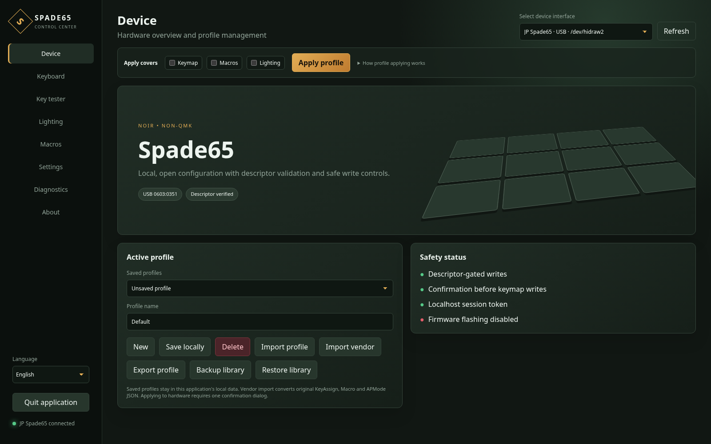
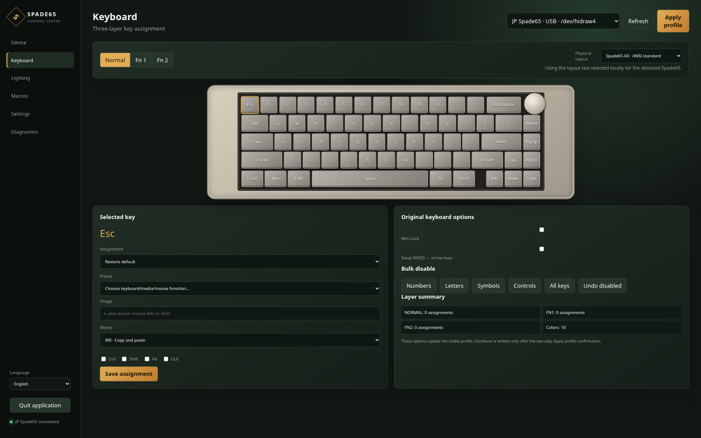
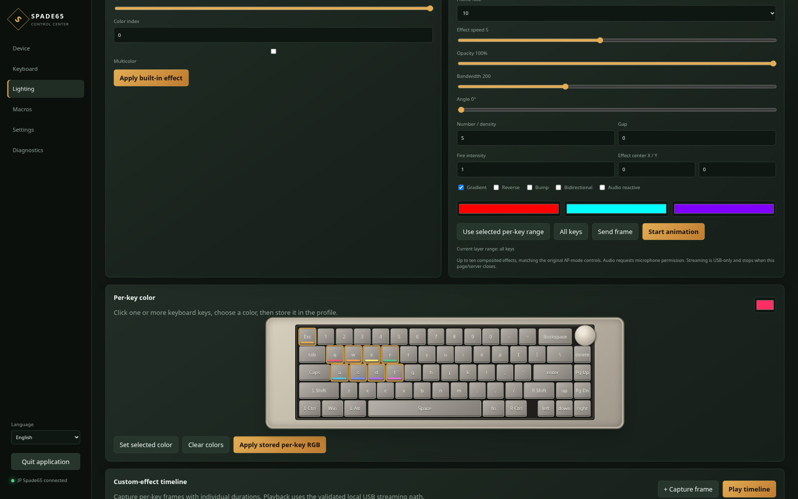
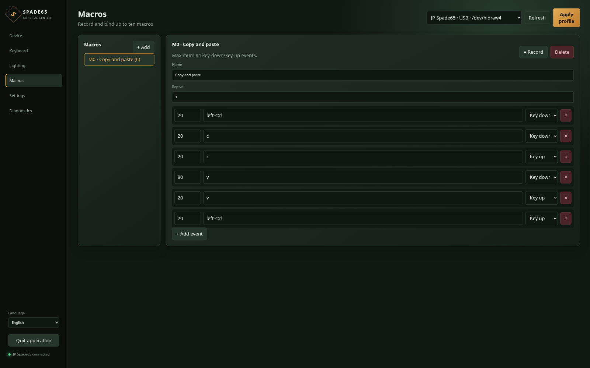

# Spade65

[English](README.md) · **Bahasa Indonesia**

Spade65 adalah aplikasi konfigurasi lintas platform independen untuk keyboard
**Noir Spade65 non-QMK**. Proyek ini menyediakan antarmuka desktop mandiri dan
alat command-line untuk mengelola pengaturan keyboard yang didukung tanpa
bergantung pada aplikasi resmi khusus Windows.

Proyek ini dibuat berdasarkan analisis statis `Spade65_SETUP_20240403.exe` dan
validasi bertahap menggunakan unit Spade65 fisik. Hanya jalur konfigurasi yang
dapat direproduksi dengan batas keselamatan yang jelas yang didukung.

## Pratinjau

<table>
  <tr>
    <td width="50%"><a href="docs/images/spade65-overview.png"></a></td>
    <td width="50%"><a href="docs/images/spade65-keyboard.png"></a></td>
  </tr>
  <tr>
    <td align="center"><strong>Ringkasan dan profil</strong></td>
    <td align="center"><strong>Keyboard dan keymap</strong></td>
  </tr>
  <tr>
    <td width="50%"><a href="docs/images/spade65-lighting.png"></a></td>
    <td width="50%"><a href="docs/images/spade65-macros.png"></a></td>
  </tr>
  <tr>
    <td align="center"><strong>Pencahayaan dan RGB</strong></td>
    <td align="center"><strong>Macro</strong></td>
  </tr>
</table>

## Fitur utama

- GUI desktop mandiri dan CLI pada Linux, Windows, dan macOS.
- System tray native, perilaku close-to-tray, dan opsi menjalankan aplikasi
  setelah login pada ketiga platform desktop, dengan fallback jendela terlihat
  bila sesi Linux tidak memiliki tray.
- Deteksi perangkat otomatis dan pratinjau tersinkron untuk keempat layout fisik
  Spade65: ANSI/ISO dengan spacebar standar atau terpisah.
- Editor keymap tiga layer dengan kategori assignment yang tersedia pada
  aplikasi original.
- Perekaman dan penyuntingan macro, pengaturan pengulangan, serta binding tombol.
- Seluruh 20 ID efek pencahayaan bawaan, brightness, speed, palet, RGB per
  tombol, efek AP mode, audio reactive, dan custom-effect timeline.
- Profil lokal, backup/restore seluruh library, serta konversi ekspor JSON
  KeyAssign, Macro, dan APMode dari aplikasi original.
- Efek background dan asosiasi aplikasi-ke-profil opsional pada ketiga platform
  desktop yang didukung.
- Antarmuka English sebagai default, Bahasa Indonesia disertakan, dan struktur
  katalog yang memudahkan penambahan bahasa lain.

GUI dan backend berjalan secara lokal. Server tertanam hanya menerima koneksi
loopback, memakai token sesi acak, dan menolak nilai Host serta Origin asing.

## Apa yang tersimpan di keyboard?

Spade65 menggunakan konfigurasi yang tersimpan pada perangkat dan fitur yang
berjalan pada host:

| Konfigurasi | Lokasi penyimpanan | Tetap tersedia setelah berpindah komputer atau sistem operasi? |
|---|---|---|
| Keymap, macro, pencahayaan bawaan, pencahayaan per tombol, debounce, dan timer dongle yang didukung | Dikirim melalui report konfigurasi vendor ke memori keyboard | Dirancang untuk tetap tersimpan di keyboard setelah diterapkan |
| Library profil, layout visual terpilih, asosiasi aplikasi, playback AP/custom timeline, dan streaming audio reactive | Data lokal aplikasi | Memerlukan Spade65 atau background service opsional pada host tersebut |

Keempat varian layout fisik tidak dapat dibaca dari descriptor keyboard. Saat
interface konfigurasi terhubung, aplikasi memulihkan layout yang terakhir
dipilih secara lokal untuk model tersebut; saat tidak ada yang terdeteksi —
termasuk saat hanya receiver hanya-baca `0603:0352` yang ada — aplikasi
menampilkan pratinjau fallback `Spade65-04 · ANSI standard`.

Apply keymap mengikuti transaksi `SetKeyMatrix` aplikasi original: collection
utama menerima keymap, hanya macro yang direferensikan, dan lighting saat ini;
setelah itu collection pendek yang descriptor-nya cocok menerima nilai debounce
yang tersimpan pada profil. Jeda yang dipakai adalah 100 ms setelah keymap, 200
ms setelah setiap macro, 100 ms setelah efek lighting, 50 ms setelah palet custom
opsional, dan 10 ms setelah debounce. Kedua collection diselesaikan serta
divalidasi sebelum write pertama; mode kabel tidak menerima report timer. Profil
tanpa `settings.debounce_ms` memakai nilai kompatibilitas historis proyek sebesar
5 ms, sedangkan profil baru pada aplikasi original dimulai dari 1 ms.

## Batas keselamatan

Firmware flashing, akses bootloader, operasi raw flash/write, dan paket HID
arbitrer sengaja **tidak diimplementasikan** karena operasi yang salah dapat
menyebabkan keyboard brick. Fitur tersebut tidak memiliki aksi GUI, endpoint
API, packet builder, ataupun fallback tersembunyi dalam proyek ini.

Write konfigurasi dibatasi oleh validasi descriptor. Penimpaan keymap meminta
satu dialog konfirmasi, sedangkan reset memerlukan konfirmasi tertulis.
Pengecualian dan perlindungan ini adalah bagian dari desain, bukan fitur rilis
yang belum selesai.

## Unduh

Paket siap jalan tersedia di
[GitHub Releases](https://github.com/dirhamtriyadi/spade65-non-qmk/releases/latest):

| Platform | Asset rilis | Catatan |
|---|---|---|
| Windows x64 | `Spade65-Windows-x64.zip` | Menyertakan executable GUI dan console; Microsoft WebView2 diperlukan |
| Linux x86_64 | `Spade65-Linux-x86_64.AppImage` | Dibangun pada Ubuntu 22.04; memakai library grafis dan desktop dari host |
| macOS universal | `Spade65-macOS-universal.dmg` | Berjalan pada Intel dan Apple silicon |

Menjalankan aplikasi paket tanpa argumen akan membuka GUI desktop.
**Pengaturan → Integrasi desktop** mengatur close-to-tray serta dapat memasang
atau menghapus startup setelah login untuk pengguna saat ini. Startup GUI ini
terpisah dari **Pengaturan → Layanan latar belakang**, yang menghasilkan
perintah untuk playback AP/timeline persisten dan asosiasi aplikasi. Setup
service `spade65ctl` khusus source tetap tersedia di
[panduan fitur host](docs/id/host-features.md).
Paket Windows belum ditandatangani dan paket macOS belum dinotarisasi, sehingga
sistem operasi dapat menampilkan peringatan keamanan. Lihat
[panduan lintas platform](docs/id/cross-platform.md) untuk catatan instalasi dan
[panduan rilis](docs/id/releasing.md) untuk build CI maupun manual.

## Mulai cepat dari source

Python 3.10 atau lebih baru diperlukan.

```bash
python -m venv .venv
. .venv/bin/activate
python -m pip install -e ".[desktop,cross-platform]"
spade65ctl gui
```

Pada Windows, aktifkan environment menggunakan
`.venv\Scripts\activate`. Pengenalan dasar CLI tersedia melalui:

```bash
spade65ctl --help
spade65ctl probe
```

Pengguna Linux biasanya perlu memasang udev rule yang disertakan sebelum
mengakses `hidraw` sebagai user biasa. Setup dan troubleshooting spesifik
platform tersedia dalam
[`docs/id/cross-platform.md`](docs/id/cross-platform.md); perintah lengkap dan
alur hardware yang aman tersedia di [`docs/id/cli.md`](docs/id/cli.md).

## Status verifikasi

Validasi fisik terkini menggunakan perangkat Linux berkabel dengan identitas
`0603:0351`, bersama receiver fisik 2,4 GHz milik keyboard tersebut yang
terdeteksi sebagai `0603:0352` dan diperiksa secara hanya-baca dengan kabel
dilepas serta keyboard beroperasi lewat 2,4 GHz. Seluruh pemeriksaan
konfigurasi di bawah ini dijalankan melalui perangkat berkabel. Penemuan
descriptor, seluruh 20 efek RGB bawaan beserta kontrol brightness dan speed,
debounce, RGB per tombol, streaming real-time, AP wave dan satu custom
timeline, aksi RGB GUI yang terautentikasi, keymap tiga layer dan macro, reset
konfigurasi, satu frame timeline melalui background service, dan pembacaan
revisi USB secara read-only telah berhasil dijalankan.

Write keymap, macro, dan reset kini telah dikirim ke perangkat berkabel: keymap
dan macro sementara diverifikasi melalui input fisik lalu dipulihkan, dan
keyboard tetap terdeteksi dengan benar setelah reset. Simpan profil yang valid
sebelum mengulanginya, karena keyboard tetap tidak menyediakan jalur
readback-and-restore yang terjamin.

Pengujian individual tersebut belum membuktikan bahwa transaksi gabungan
keymap/lighting/debounce yang baru dilengkapi mempertahankan lighting aktif
secara visual. Hasil persis dari GUI source masih menunggu konfirmasi fisik dan
tidak disimpulkan hanya dari jumlah byte report yang berhasil.

Hanya timer light-off/hibernate dongle yang masih belum dikirim. Identitas
dongle logis `0603:0356` belum pernah terdeteksi di sini, dan receiver fisik
yang terdeteksi, `0603:0352`, sama sekali tidak mengiklankan feature report,
sehingga tidak dapat membawa frame tersebut. Lihat
[`docs/id/hardware-verification.md`](docs/id/hardware-verification.md) untuk
catatan pengujian lengkap. Cakupan otomatis atau offline tidak pernah disebut
sebagai verifikasi perangkat fisik.

## Dokumentasi

- [CLI dan operasi aman](docs/id/cli.md)
- [Instalasi lintas platform dan troubleshooting](docs/id/cross-platform.md)
- [Kesetaraan fitur dengan aplikasi original](docs/id/parity.md)
- [Profil, import vendor, timeline, dan background service](docs/id/host-features.md)
- [Protokol dan format report](docs/id/protocol.md)
- [Catatan verifikasi hardware](docs/id/hardware-verification.md)
- [Panduan pengembangan](docs/id/development.md)
- [Panduan lokalisasi](docs/id/localization.md)
- [Panduan rilis dan build manual](docs/id/releasing.md)
- [Jalur cadangan CI/CD Jenkins](docs/id/jenkins.md)
- [Detail packaging desktop](packaging/README.id.md)

English adalah bahasa dokumentasi kanonis. Terjemahan Bahasa Indonesia yang
dipelihara ditautkan dari setiap panduan.

## Berkontribusi

Mulai dari [panduan pengembangan](docs/id/development.md). Sebelum mengirim
perubahan, jalankan:

```bash
python -m unittest discover -v
python -m compileall -q spade65 spade65ctl.py tests tools
```

Perubahan protokol harus menyertakan pengujian offline dan tidak boleh
memperlemah batas firmware, raw write, descriptor, atau konfirmasi. Klaim
pengujian fisik hanya boleh ditambahkan bersama catatan pengujian yang dapat
direproduksi.

## Arsip maintainer

Installer vendor asli yang digunakan sebagai referensi reverse engineering
disimpan di [repository private `spade65-vendor-archive`](https://github.com/dirhamtriyadi/spade65-vendor-archive).
Arsip ini hanya untuk maintainer, tidak diperlukan saat runtime, dan harus
tetap private.

## Hukum dan lisensi

Ini adalah proyek independen dan bukan software resmi Noir. Repository tidak
mendistribusikan installer resmi, firmware, source vendor hasil ekstraksi, atau
binary native vendor. Gunakan hanya dengan hardware milik Anda sendiri.

Kode asli proyek menggunakan [Lisensi MIT](LICENSE). Dependency yang dibundel
dan digunakan saat runtime tetap memakai lisensinya masing-masing; versi,
notices, lokasi source, dan petunjuk penggantian tersedia dalam
[`THIRD-PARTY-NOTICES.md`](THIRD-PARTY-NOTICES.md). Software, firmware, nama,
dan aset vendor tetap menjadi milik pemegang hak masing-masing.
